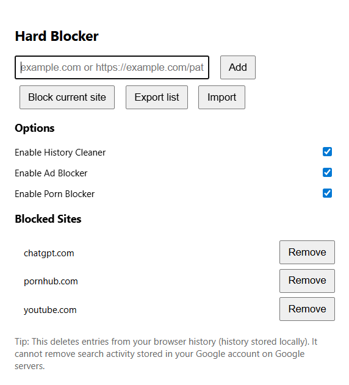
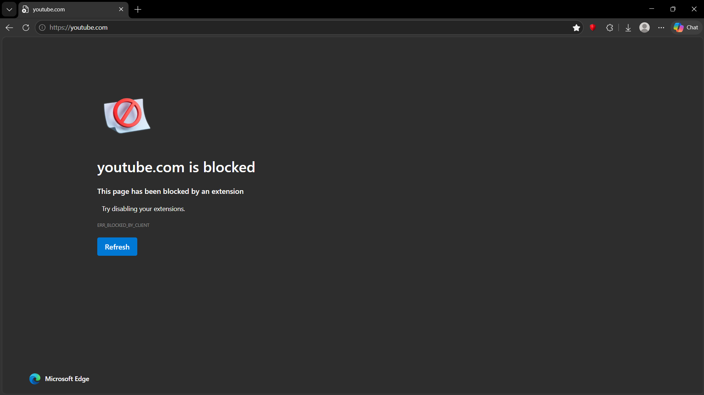

# Hard-Blocker 

Hard-Blocker is a browser extension focused on productivity and digital discipline by blocking distracting or unwanted websites.
It currently blocks over 2,100 adult websites, helps reduce intrusive ads, and includes a history cleaner that automatically removes 
blocked or inappropriate websites from your browsing history.

## *Installation*

1. Download the project as a ZIP file (Code → Download ZIP) and extract it.
2. Open your browser and go to: `chrome://extensions`
3. Enable **Developer mode**.
4. Click **Load unpacked**.
5. Select the correct folder:
   - Open the extracted folder
   - Go into the **inner `hard-blocker-main` folder** (the one that contains `manifest.json`)
   - Select that folder and click **Select Folder**
6. The extension **Hard Blocker** should now appear in your extensions list.

## Features

- Website blocking
- Custom block lists
- Ads blocking
- History Cleaner (Still beta)
- Simple and lightweight
- Fast and responsive
- Productivity-focused

## Planned Features

- Cleaner & Better Popup (Done but can be better)
- Fisnish history cleaner
- Scheduled blocking
- Firefox support

## Technologies Used

- JavaScript
- HTML/CSS
- Chrome Extension API

## Screenshots

  
  

#
#

  Created and maintained by <strong>Huaux Raphaël</strong>.

